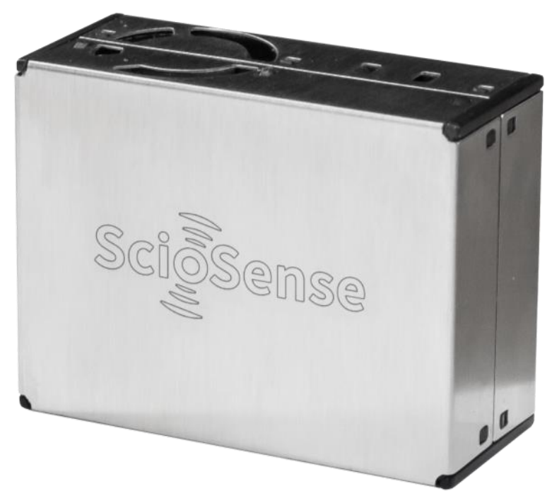
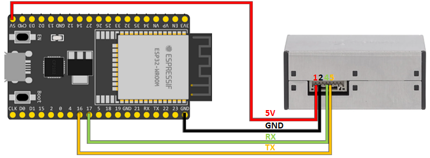

# ScioSense APC1 Arduino Library
the Arduino library for the Air Purification Combo ONE (APC1) sensor with UART or I2C interface from ScioSense.

The APC1 is a compact, box-shaped, all-in-one environmental sensor solution produced by
[ScioSense](http://www.sciosense.com) to precisely
measure particulate matter and aerosols, volatile organic compounds, temperature and
humidity. It leverages the ScioSense leading edge sensor technology to provide an
accurate, fully calibrated, maintenance-free solution to air quality monitoring.

For maximum flexibility, the APC1 provides up to 20 environmental signal parameters
through UART or I2C interfaces. Moreover, it features temperature compensation
algorithms to simplify integration on system level, thereby accelerating time to market at
minimal overall BOM costs.

The APC1 is a proven, maintenance-free technology, designed for high volumes and
reliability.

## Links
* [Further information about the APC1](https://www.sciosense.com/apc1-air-quality-combo-sensor/)
* [Datasheet](https://www.sciosense.com/wp-content/uploads/2024/07/APC1-Datasheet.pdf)
* Buy the APC1 on [Mouser](https://mou.sr/3RccQwh) or [Digikey](https://www.digikey.nl/short/2v43qfh4)
* Buy the APC1 evaluation kit on [Mouser](https://mou.sr/3LfXiUG)
 
## Prerequisites
It is assumed that
 - The Arduino IDE has been installed.
   If not, refer to "Install the Arduino Desktop IDE" on the
   [Arduino site](https://www.arduino.cc/en/Guide/HomePage).
- The library directory is at its default location. Normally this is `C:\Users\[your_username]\Documents\Arduino\libraries`.

You might need to add your board to the Arduino IDE. This library was tested with the [Espressif ESP32](https://www.espressif.com/en/products/socs/esp32). 
For the installation of the ESP32 in the Arduino IDE, see [Arduino ESP32 Installation](https://docs.espressif.com/projects/arduino-esp32/en/latest/installing.html)

## Installation

### Installation via Arduino Library Manager
- In the Arduino IDE, navigate to the Arduino Library Manager on the left side (or, alternatively, select Sketch > 
Include Library > Manage Libraries...)
- Search for `ScioSense_APC1`
- Select the library from the search results and press `Install`

### Manual installation
- Download the code from this repository via "Download ZIP".
- In Arduino IDE, select Sketch > Include Library > Add .ZIP library... and browse to the just downloaded ZIP file.
- When the IDE is ready this README.md should be located at `C:\Users\[your_username]\Documents\Arduino\libraries\ScioSense_APC1\README.md`.

## Wiring

### General
Please make sure that you use the correct supply voltage: The supply voltage is VDD = 5.0 V and the communication
interfaces run at 3.3 V TTL level.

### Example with ESP32 (UART)
This example shows how to wire a [ESP32DevKitC](https://docs.espressif.com/projects/esp-idf/en/latest/esp32/hw-reference/esp32/get-started-devkitc.html#get-started-esp32-devkitc-board-front) 
with the APC1 for UART communication.

|  APC1   |     ESP32 |
|:-------:|:---------:|
| VDD (1) |      5V   |
| GND (2) |      GND  |
| RX (4)  | TX2 (17)  |
| TX (5)  | RX2 (16)  |

## Build an example
To build an example sketch
 - (Re)start Arduino.
 - Open File > Examples > Examples from Custom Libraries > ScioSense_APC1 > 01_Basic_UART (or any other of the provided 
examples you wish to run)
 - Make sure Tools > Board lists the correct board.
 - Select Sketch > Verify/Compile.

## Contributing
Contributions in the form of issue opening or creating pull requests are very welcome!

## Acknowledgements
This library is developed for ScioSense by [at² GmbH](https://www.at2-software.com/en/) 

@at2software

### ScioSense is a Joint Venture of ams AG 
